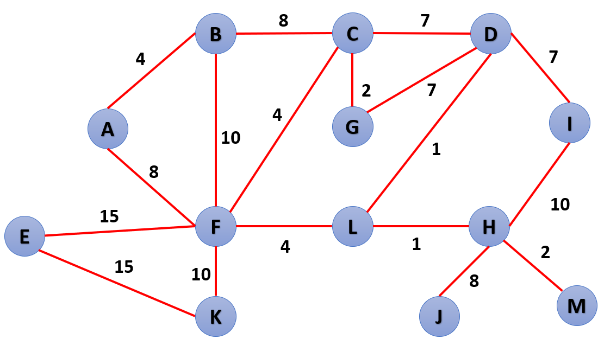

## **PC 3:** Práctica Calificada 3
**course:** Programación III  
**unit:** 6  
**cmake project:** prog3_pc3_v2022_1
## Instructions
- El tiempo límite para la evaluación es 100 minutos.
- Cada pregunta deberá ser respondida en un archivo fuente (`.cpp`) y un archivo cabecera (`.h`) con el número de la pregunta:
    - `P1.cpp`, `P1.h`
    - `P2.cpp`, `P2.h`
- Adicionalmente, la **pregunta #3** debía de ser entregada como un PDF, MS Word o PNG
- Deberás subir estos archivos directamente a [www.gradescope.com](https://www.gradescope.com) o se puede crear un `.zip` que contenga todos ellos y subirlo.

Enunciado en archivo: **CS2013 - PC03 - 2022-1.pdf**

## Question #1 - Stack (7 points)

Elaborar la función de template `fixed_stack(string text, size_t sz)` que cumpla las siguientes reglas:

1. El texto siempre será ingresado en mayúscula.
2. Una letra significa un `push` de la letra en un stack y un asterisco (*) significa un `pop`.
3. Solo se permitirá almacenar en el stack una cantidad límite de valores correspondientes al valor del parámetro `sz`, ejemplo si `sz` es `7` solo se podrá almacenar 7 valores no más.
4. Mientras no este lleno se podrá realizar `push` como se menciona en 1.
5. En caso este lleno se verificará si la letra es mayúscula o minúscula
6. En caso sea mayúscula se convertirá la letra del `top` en minúscula y se descarta la letra que se intentó ingresar.
7. En caso sea minúscula el `top` se reemplazara por la nueva letra que se intenta ingresar.
8. Cada vez que se realice un `pop` la letra deberá ser almacenada en un contenedor que por default será un `vector`, pero puede ser personalizado a `deque` o `list`, la función debe retornar el contenedor con sus valores. 

**Use Case #1:**
```cpp
  string text = "ESTA*ES**UNA*PRUEBA***";
  vector<char> result = fixed_stack(text, 3);
  copy(begin(result), end(result), ostream_iterator<char>(cout, " "));
  // El resultado es: t e S n p u b U E
```
**Use Case #2:**
```cpp
  string text = "PROGRAMMING*THREE***";
  deque<char> result = fixed_stack<deque>(text, 4);
  copy(begin(result), end(result), ostream_iterator<char>(cout, " "));
  // El resultado es: g a m n t r E O R
```

## Question #2 - Hash (6 points)

Escribir la función:

```cpp
    std::unordered_set<address_t> near_addresses(const vector<address_t>& address);
```
Esta función debe retornar un `std::unordered_set` que cuyo key se genere utilizando el atributo `reference` de modo que si se utiliza el método `find` de la clase `std::unordered_set` se pueda buscar con éxito una dirección utilizando un objeto `address_t` donde solo el atributo `reference` tenga valor y el resto no tenga valores.

La clase que almacenará las direcciones debe ser una estructura como se muestra a continuación:
```cpp
struct address_t {
    string reference;
    double latitud;
    double longitud;
    address_t(string ref, double lat, double lon);
    friend ostream& operator <<(ostream& os, const address_t& address);
};
```
**NOTA:** Se requiere sobrecargar el operador `==` y especializar el método `std::hash` para que acepte generar keys
          utilizando `address_t, ver: (https://en.cppreference.com/w/cpp/utility/hash)  

**Use Case #1:**
```cpp
  vector<address_t> vec = {
      {"Javier Prado Este 123", -12.092052, -77.033073},
      {"Medrano Silva 165", -12.135661, -77.022590},
      {"Plaza Mayor de Lima", -12.045680, -77.030144},
      {"Plaza San Martin", -12.051566, -77.035015},
      {"Parque Universitario", -12.054063, -77.031614},
      {"Estadio Nacional", -12.0672501, -77.0336725}
    };

  auto addresses = hash_addresses(vec);
  auto iter = addresses.find({"Plaza Mayor de Lima", 0, 0});    // Se busca utilizando un objeto address_t que
                                                                // solo contiene el valor de reference,
                                                                // latitud y longitud tiene 0, 0 al buscarlo
  if (iter != end(addresses))
    cout << *iter << endl;
  else
    cout << "Not found\n";

  // Resultado: Plaza Mayor de Lima -12.0457 -77.0301
```


**Use Case #2:**
```cpp
  auto addresses = hash_addresses({
    {"Javier Prado Este 123", -12.092052, -77.033073},
    {"Medrano Silva 165", -12.135661, -77.022590},
    {"Plaza Mayor de Lima", -12.045680, -77.030144},
    {"Plaza San Martin", -12.051566, -77.035015},
    {"Parque Universitario", -12.054063, -77.031614},
    {"Estadio Nacional", -12.0672501, -77.0336725}
  });

  auto iter = addresses.find({"Palacio de Justicia", 0, 0});    // Se busca utilizando un objeto address_t que
                                                                // solo contiene el valor de reference,
                                                                // latitud y longitud tiene 0, 0 al buscarlo
  if (iter != end(addresses))
    cout << *iter << endl;
  else
    cout << "Not found\n";
  // Resultado: Not found
```

**Use Case #3:**
```cpp
  auto addresses = hash_addresses({
    {"Javier Prado Este 123", -12.092052, -77.033073},
    {"Medrano Silva 165", -12.135661, -77.022590},
    {"Plaza Mayor de Lima", -12.045680, -77.030144},
    {"Plaza San Martin", -12.051566, -77.035015},
    {"Parque Universitario", -12.054063, -77.031614},
    {"Estadio Nacional", -12.0672501, -77.0336725}
  });

  auto iter = addresses.find({"Plaza San Martin", 10, 20});     // Se busca utilizando un objeto address_t que
                                                                // solo contiene el valor de reference,
                                                                // latitud y longitud tiene 0, 0 al buscarlo
  if (iter != end(addresses))
    cout << *iter << endl;
  else
    cout << "Not found\n";
  // Resultado: Plaza San Martin" -12.051566 -77.035015
```

## Question #3 - Algoritmos de grafos BFS, DFS, Prim y Kruskal (7 points)

Basado en la imagen, ubicar los árboles expandidos generados de los algoritmos `BFS`, `DFS`, `Prim` y `Kruskal`.

**NOTA:**  
1. Para los casos de BFS, DFS y Prim empezar de cualquier nodo.  
2. las respuestas de los algoritmos BFS, DFS y Prim deben incluir:
   * El vértice de inicio.  
   * Remarcar, con un resaltador o una línea adicional en la imagen, las aristas recorridas y enumerarlas en orden de visita.  
   * Como resultado, incluir la lista de todas las aristas recorridas.  
3. En caso de Kruskal adicionalmente incluir el priority queue inicial.


